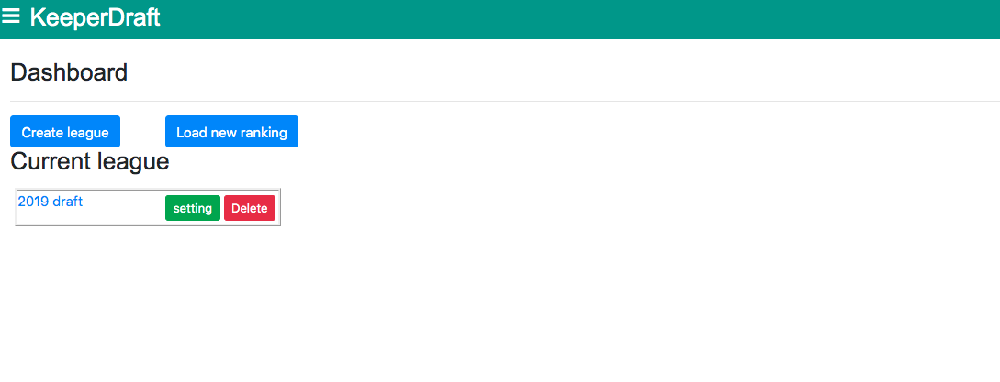
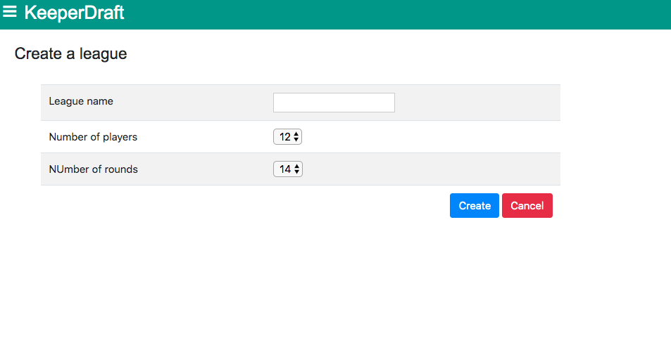
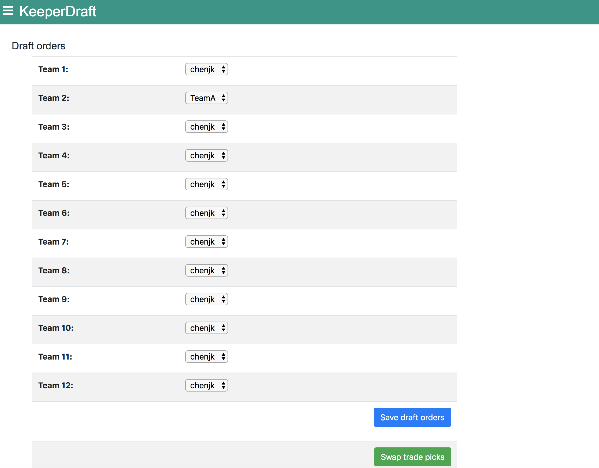
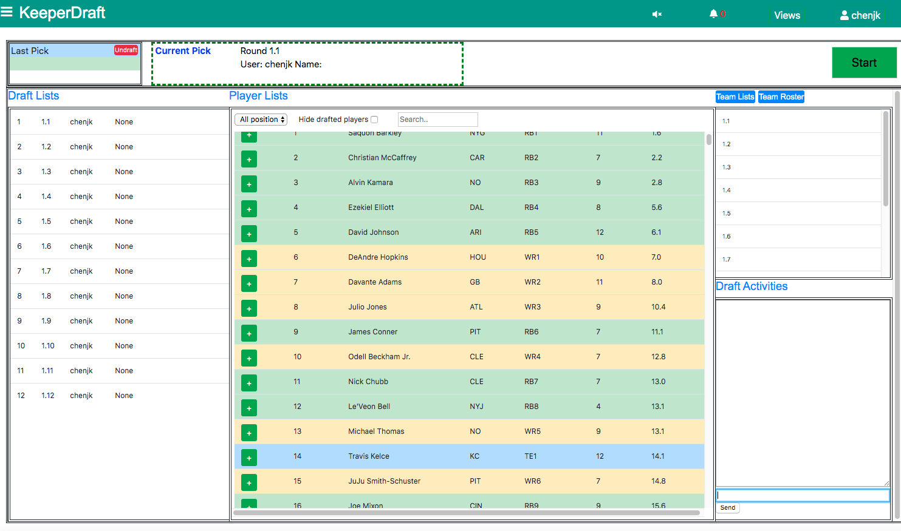
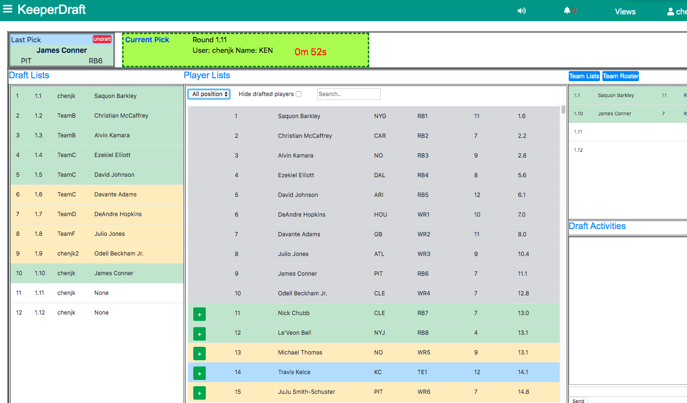

# keeperdraft
A live drafting tool developed in Django, Django Channels, Python, HTML, JavaScript for Fantasy Football Keeper League to allow for multi-player live interactions during a draft

Each team can have two keepers, and picks that traded from previous years. And allow live chat and trades during the draft

[Demo_create_league](https://streamable.com/u9klk)

[Demo_trade](https://streamable.com/pvbeg)

[Demo](https://streamable.com/gvyly)
